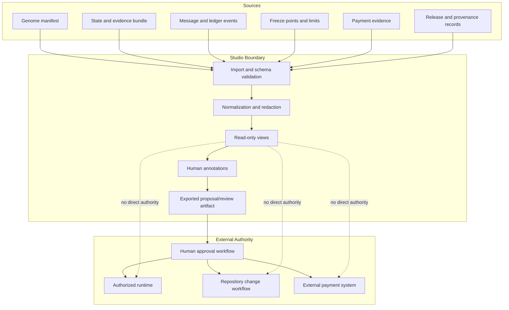
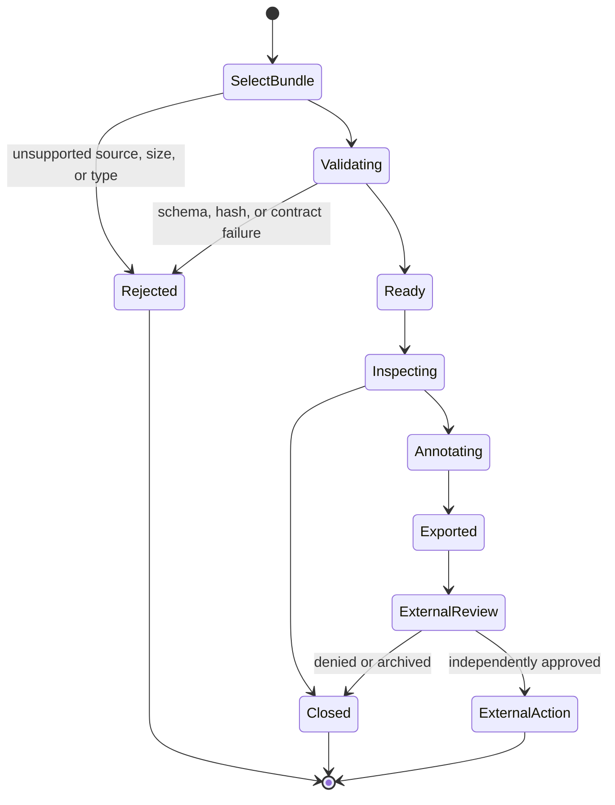
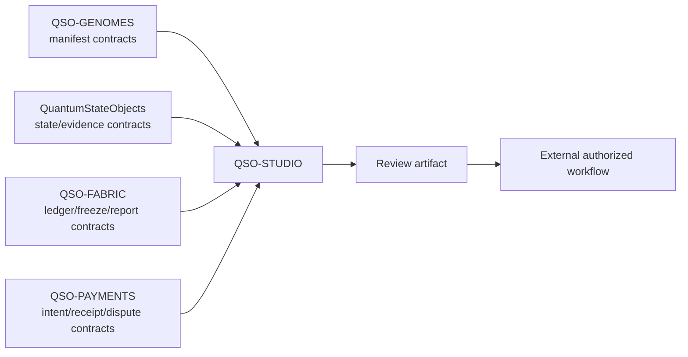

# QSO-STUDIO Architecture

## Architectural objective

QSO-STUDIO provides a review surface over versioned evidence. It must not become an implicit control plane. The core rule is that **display, annotation, proposal, approval, execution, repository mutation, and settlement are separate authorities**.

## Component boundaries

### Importer

The importer accepts a named, versioned bundle from a local file or separately approved read-only source. It verifies content type, size, schema version, source commit, and hashes before parsing. Unsupported or malformed records remain errors; they are not coerced into plausible data.

### Normalizer and redactor

Normalization converts supported records into stable view models while preserving source references. Redaction removes or masks fields according to declared data classification. Every transformation must be attributable and reversible where policy permits.

### View layer

Views render objects, evidence, messages, freeze points, provenance, release status, and payment records. Imported values are text/data, never executable markup or commands. Visualizations require textual alternatives and visible uncertainty/error states.

### Annotation and proposal layer

Annotations belong to the reviewing user and must remain distinct from source evidence. Exported proposals include the source bundle hash, reviewer identity or role where available, timestamp, requested change, rationale, and explicit statement that external approval is required.

### External adapters

Runtime execution, Git repository mutation, credential use, and payment operations are out-of-process capabilities. Studio may invoke them only through separately versioned, authenticated, least-privilege interfaces after explicit approval. No such interface is part of the current documentation candidate.

## Read-only workflow

## Trust zones

| Zone | Trusted for | Not trusted for |
|---|---|---|
| Evidence source | Supplying bytes and declared metadata | Executable content, authorization, or truth without validation |
| Studio importer | Contract and integrity checks | Granting operational authority |
| Studio view | Human-readable presentation | Approval, execution, repository writes, or settlement |
| Reviewer | Notes and explicit review decisions | Automatic expansion beyond assigned role |
| External workflow | Its separately approved action | Reinterpreting Studio display state as authorization |

## Security requirements

- Enforce strict size, depth, count, and parsing limits.
- Reject duplicate keys and ambiguous encodings where supported formats permit them.
- Use content security policy and avoid remote resources in a future web app.
- Escape all imported content and sanitize links.
- Disable embedded scripts, HTML, SVG scripting, commands, and dynamic imports.
- Keep secrets server-side and outside evidence bundles.
- Bind exported proposals to source hashes and contract versions.
- Log external action requests and responses without exposing credentials.
- Fail closed on stale, missing, or incompatible upstream contracts.
- Preserve errors, unknown values, and redaction markers.

## Accessibility architecture

Every visualization must have a structured text or table representation. Focus order must follow the review workflow. Statuses require text labels in addition to color or icons. Motion and live updates must respect reduced-motion settings and provide pause/stop controls when applicable. Errors must identify the affected record and provide a safe recovery path.

## Integration contract map

Studio consumes read-only version/hash references. It does not import executable authority from upstream repositories and does not export authorization downstream.

## Verification strategy

### Documentation candidate

- verify every repository path and publication statement;
- validate HTML/CSS and internal/external links;
- test keyboard navigation, focus, semantics, contrast, scaling, and reduced motion;
- inspect privacy claims, external links, workflow permissions, and secret exposure;
- generate the Pages artifact from a clean checkout;
- retain the immutable commit, commands, tool/action versions, checksums, and rollback procedure.

### Later UI candidate

- schema and fixture tests for every supported bundle version;
- negative fixtures for malformed, oversized, stale, duplicated, hostile, and unknown content;
- component, contract, accessibility, security, and smoke tests;
- proof that imported content cannot execute;
- proof that proposals cannot bypass external approval;
- proof that no credentials, unrestricted writes, runtime execution, or settlement path exists in the client boundary.
