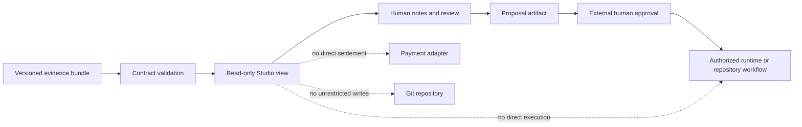

# QSO-STUDIO Project Guide

QSO-STUDIO is the proposed human-review interface for the Quantum State Object ecosystem. It is designed to help researchers and operators inspect genomes, state, evidence, messages, proposals, freeze points, provenance, experiments, release status, and payment records without inheriting authority that belongs to runtimes, repositories, approval systems, or external settlement services.

> **Current maturity:** product/UX charter candidate and documentation surface. No verified application, runtime orchestration, repository-write, credential, or payment-control capability is released.

## Product purpose

QSO-STUDIO should make complex QSO evidence understandable and reviewable. Its first approved workflow is intentionally narrow:

1. load a deterministic fixture or read-only evidence bundle;
2. validate the bundle against a declared contract version;
3. show source, state, messages, freeze points, errors, and provenance;
4. allow a human to annotate or prepare a proposal;
5. export a review artifact without executing the proposal or mutating the source repository.

## Authority boundary

Studio may visualize evidence and prepare proposals. It may not approve its own proposals, execute untrusted code, write unrestricted repository content, hold credentials, control production payments, or convert a UI action into runtime authority without an explicit external contract and approval.

## Primary users

The charter candidate assumes three user groups:

- **Researchers:** inspect QSO state, experiment evidence, comparisons, and reproducibility data.
- **Operators:** review limits, freeze points, errors, health, provenance, and release status.
- **Maintainers/reviewers:** assess proposed changes and export bounded review artifacts for an external authorized workflow.

These user groups remain candidates until P0 approval is recorded.

## Information architecture

| Surface | Purpose | Authority |
|---|---|---|
| Object overview | Identity, genome reference, current state, capability labels | Read-only |
| Evidence explorer | Sources, hashes, validation outcomes, uncertainty, provenance | Read-only |
| Message timeline | Bounded communications and causal ordering | Read-only |
| Freeze-point inspector | Snapshot hashes, limits, stop reasons, rollback references | Read-only |
| Proposal workspace | Human-authored notes and bounded proposed changes | Export only |
| Release view | Task chain, gate status, artifacts, checksums, blockers | Read-only |
| Payment view | Intent, authorization, allocation, receipt, dispute evidence | Read-only; no custody or settlement |

## Read-only evidence bundle

A future versioned bundle should include:

- bundle and schema versions;
- source repository and immutable commit;
- object/genome identifiers and hashes;
- state and evidence records;
- bounded message events;
- freeze points, limits, and stop reasons;
- validation results and errors;
- provenance and generation commands;
- optional payment evidence with explicit environment labels;
- redaction and data-classification metadata.

Unknown fields or unsupported versions should fail closed or be clearly isolated as unrendered evidence. Studio must not execute embedded scripts, HTML, commands, links, or repository instructions.

## Privacy and security model

- Render all imported content as untrusted data.
- Apply strict output encoding and content-security policy in any future web application.
- Do not load remote resources from evidence bundles by default.
- Keep credentials outside client bundles, fixtures, logs, and exported review artifacts.
- Minimize and redact personal, financial, or operationally sensitive metadata.
- Preserve source hashes and transformation history.
- Require explicit external authorization for repository writes, runtime actions, or payment operations.
- Make errors and unsupported evidence visible rather than substituting fabricated values.

## Accessibility requirements

The first documentation artifact and any later UI must support:

- semantic headings, landmarks, lists, tables, and status text;
- complete keyboard navigation and visible focus;
- readable contrast and zoom/scaling;
- reduced-motion preferences;
- textual alternatives for diagrams and visualizations;
- status communication that does not depend on color alone;
- recoverable validation and import errors.

## Developer onboarding

1. Read `README.md`, `taskchain.md`, `release.md`, and `changelog.md`.
2. Treat the charter and user groups as proposals until P0 approval is recorded.
3. Do not add runtime, repository-write, credential, or payment authority to Studio.
4. Build one fixture-backed read-only workflow before adding broader orchestration concepts.
5. Validate every input and render it as untrusted content.
6. Keep mock data labeled as fictional and separate from real evidence.
7. Record exact build, link, accessibility, security/privacy, test, artifact, checksum, provenance, and rollback evidence.

## Release gates

The documentation candidate remains blocked until:

- users, workflows, platforms, ecosystem role, privacy/data model, license, distribution target, and authority boundaries are approved;
- the Pages artifact builds reproducibly from an immutable commit;
- links, HTML, semantics, keyboard use, contrast, scaling, reduced motion, privacy, and security checks pass;
- capability claims match repository evidence;
- checksums, provenance, and rollback evidence are retained.

A later UI candidate additionally requires versioned evidence contracts, deterministic fixtures, component/contract/security/accessibility tests, and proof that no direct execution, payment, credential, or unrestricted write path exists.

## Documentation map

- [Public Studio concept page](index.html)
- [Architecture and workflow](ARCHITECTURE.md)
- [Repository overview](../README.md)
- [Task chain](../taskchain.md)
- [Release plan](../release.md)
- [Changelog](../changelog.md)
