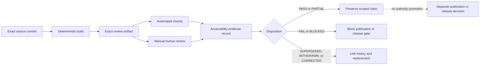

# Accessibility review evidence

Status: `DOCUMENTED_NOT_CERTIFIED`

This guide defines how QSO-STUDIO records accessibility evidence for documentation, a future rendered Pages artifact, synthetic review consumers, and any later user interface. It does not certify accessibility, authorize publication, approve a product charter, or grant runtime, repository, reviewer, architecture, payment, or release authority.

## Why exact evidence matters

An accessibility claim is meaningful only when it identifies the exact artifact, environment, method, result, reviewer, and correction state that produced the claim. Source Markdown, a rendered static site, synthetic consumer output, and a future interactive application are different review surfaces. A passing check for one surface must not be promoted to another.

## Review surfaces

| Surface | Current state | Required evidence | What the evidence cannot establish |
|---|---|---|---|
| Source Markdown | Candidate | Heading, link, table, diagram-alternative, terminology, and plain-language review | Rendered browser behavior or assistive-technology compatibility |
| Rendered Pages artifact | Not published | Exact commit, build inputs, artifact digest, URL or local route, viewport, browser, keyboard, zoom/reflow, contrast, reduced-motion, and screen-reader evidence | Product approval, release approval, or application accessibility |
| Synthetic manifest consumer | Candidate | Text-equivalent result states, deterministic error order, correction and supersession visibility, and non-color interpretation | Ecosystem admission or live consumer accessibility |
| Synthetic architecture-review consumer | Candidate | Accessible review-state vocabulary, dissent and appeal visibility, correction linkage, and separation of review from decision | Reviewer appointment, real quorum, or architecture authority |
| Future interactive Studio | Not implemented | Component, workflow, keyboard, focus, screen-reader, zoom, reflow, contrast, motion, error-recovery, cognitive-access, and user-comprehension evidence | Runtime, repository-write, approval, or payment authority |

## Evidence and authority states

Every accessibility record uses explicit text states. Visual styling may reinforce a state but may not replace its label or meaning.

### Evidence states

- `NOT_REVIEWED` — no applicable review has been recorded.
- `PARTIAL` — some required methods or environments were reviewed; remaining coverage is named.
- `PASS` — the exact artifact passed the declared methods and acceptance criteria.
- `FAIL` — one or more declared criteria failed; the failure and affected route are preserved.
- `BLOCKED` — review could not be completed because an input, environment, decision, or authorized reviewer was unavailable.
- `UNKNOWN` — evidence is insufficient or contradictory and no stronger state is justified.
- `SUPERSEDED` — a newer exact-artifact record replaces this record without deleting its history.
- `WITHDRAWN` — the claim was intentionally retracted because its basis is no longer valid.
- `CORRECTED` — a defect was repaired and linked to both the failed generation and the new review generation.

### Authority states

Accessibility presentation must also distinguish:

- `OBSERVATION` — source facts or tool output;
- `INTERPRETATION` — a reviewer explanation of those facts;
- `ANNOTATION` — a user-authored note that does not change source evidence;
- `PROPOSAL` — a requested change that has not been accepted;
- `REVIEW_DIAGNOSTIC` — synthetic or procedural review output;
- `HUMAN_DISPOSITION` — an authorized human decision within a separately defined role;
- `EXTERNAL_ACTION` — a separately authorized change outside Studio.

A `PASS` accessibility record never converts an observation, proposal, or diagnostic into approval or external action.

## Evidence flow



### Equivalent prose

The source commit is built deterministically into one exact artifact. Automated checks and manual review inspect that same artifact and produce a scoped evidence record. A pass or partial result preserves only the declared accessibility claim. A failure or blocked result keeps the applicable publication or release gate closed. Superseded, withdrawn, and corrected records retain links to the affected generations. None of these states authorizes publication, release, runtime execution, repository mutation, reviewer appointment, architecture decisions, or payment actions.

## Minimum evidence binding

Each record must identify:

1. repository and exact source commit;
2. pull request or change identifier when applicable;
3. build workflow and run attempt;
4. artifact name, immutable digest, and retention or custody location;
5. rendered route or local entry point;
6. browser, operating system, viewport, zoom level, input method, assistive technology, and relevant preference settings;
7. review methods and acceptance criteria;
8. result for every applicable criterion;
9. reviewer identity or accountable role, while minimizing personal data;
10. known limitations and unreviewed surfaces;
11. correction, supersession, withdrawal, and rollback links;
12. explicit authority flags, all denied unless a separate approval record grants them.

## Manual review protocol

### Keyboard and focus

- Reach every interactive element with the keyboard alone.
- Preserve a logical focus order that follows the evidence-review workflow.
- Keep focus visible at every step and return it predictably after dialogs or route changes.
- Provide a bypass for repeated navigation when a rendered site or application includes it.
- Confirm that no hover-only or pointer-only action is required.

### Screen reader and semantics

- Confirm one clear page title and a logical heading hierarchy.
- Verify landmarks, names, descriptions, table headers, lists, form labels, errors, and status announcements.
- Read diagrams through their prose equivalents and verify that no conclusion exists only in the image.
- Ensure current, stale, corrected, withdrawn, unsupported, conflicting, and blocked states are announced in text.
- Keep source evidence, annotations, proposals, diagnostics, and decisions distinguishable without relying on layout.

### Zoom, reflow, and low-vision review

- Review at 200% and 400% zoom.
- Confirm horizontal scrolling is not required for ordinary text and controls, except where a bounded data table or code sample has an accessible alternative.
- Verify that content does not overlap, clip, disappear, or reorder misleadingly.
- Confirm visible focus, state labels, errors, and provenance remain available at narrow widths.

### Contrast and non-color meaning

- Measure text, control, focus, boundary, and status contrast against the accepted standard for the target surface.
- Pair color with text, pattern, shape, or another persistent non-color cue.
- Verify high-contrast and forced-colors behavior when the target environment supports them.
- Preserve uncertainty and risk distinctions when custom colors or styles are unavailable.

### Motion and timing

- Respect reduced-motion preferences.
- Avoid motion that is required to understand evidence order or state transitions.
- Provide pause, stop, or static alternatives for any non-essential animation.
- Do not impose time limits on review unless a separately justified security requirement exists and a safe extension or recovery path is provided.

### Cognitive access and comprehension

- Define specialized terms before use and keep the same term for the same concept.
- Separate source facts from interpretation, proposal, review, decision, and action.
- Use concise summaries followed by progressively disclosed detail.
- Explain why a route is blocked and identify the next safe action.
- Test whether a reviewer can correctly identify currentness, uncertainty, authority, correction, withdrawal, and rollback state from the rendered artifact.

### Graphs, timelines, and dense evidence

- Provide a structured table or narrative alternative for every graph or timeline.
- Preserve ordering, source identity, uncertainty, missing data, conflicts, corrections, and withdrawals in the alternative.
- Support navigation by meaningful group or record rather than requiring traversal of every visual point.
- Never collapse conflicting records into one apparently certain value.

### Errors and recovery

- Identify the affected record, field, route, or action.
- Explain the failure in plain language without discarding diagnostic detail.
- Preserve the user's notes and review position where safe.
- Provide a deterministic recovery, retry, export, or exit path.
- Keep failed, stale, corrected, and withdrawn evidence visible according to retention policy.

## Documentation-only evidence record

The following template is non-authorizing and intentionally records denied authority:

```yaml
profile: qso-studio.accessibility-review-evidence.v1
status: NOT_REVIEWED
scope:
  surface: source-markdown | rendered-pages | synthetic-consumer | future-ui
  repository: aevespers2/QSO-STUDIO
  source_commit: "<40-character commit>"
  pull_request: null
artifact:
  workflow_run: null
  workflow_attempt: null
  name: null
  sha256: null
  route: null
environment:
  operating_system: null
  browser: null
  viewport: null
  zoom: null
  input_method: null
  assistive_technology: null
  preferences: []
methods:
  automated: []
  manual: []
results:
  keyboard_focus: NOT_REVIEWED
  screen_reader_semantics: NOT_REVIEWED
  zoom_reflow: NOT_REVIEWED
  contrast_non_color: NOT_REVIEWED
  reduced_motion_timing: NOT_REVIEWED
  cognitive_comprehension: NOT_REVIEWED
  graphs_timelines: NOT_REVIEWED
  errors_recovery: NOT_REVIEWED
limitations: []
review:
  reviewer_role: null
  reviewed_at: null
  supersedes: null
  corrects: null
  withdrawal_reason: null
authority:
  certifies_accessibility: false
  approves_pages_publication: false
  approves_product_charter: false
  approves_release: false
  grants_runtime_authority: false
  grants_repository_write: false
  appoints_reviewers: false
  decides_architecture: false
  grants_payment_authority: false
```

## Fail-closed stop conditions

Keep publication, documentation release, or UI release blocked when:

- the source commit or artifact digest is missing or ambiguous;
- automated and manual reviews inspected different artifact generations;
- a required method, browser, viewport, input path, or assistive technology is omitted without a recorded limitation;
- a diagram lacks equivalent prose;
- status or authority meaning depends on color, motion, position, or iconography alone;
- keyboard focus is lost or a route is pointer-only;
- zoom or reflow hides evidence, provenance, uncertainty, errors, or recovery controls;
- a screen reader cannot distinguish source evidence, annotation, proposal, diagnostic, decision, and action;
- the review record presents `PARTIAL`, `UNKNOWN`, `BLOCKED`, or stale evidence as `PASS`;
- correction, withdrawal, or supersession is not propagated to the public claim;
- the record implies publication, release, runtime, repository, governance, or payment authority.

## Correction, withdrawal, and rollback

A failed accessibility generation is preserved as evidence. A correction creates a new exact-artifact record linked to the failure and explains the changed files, affected routes, methods repeated, and residual limitations. A withdrawal marks the prior claim invalid without deleting its history. Rollback restores the last verified accessible artifact or keeps the route unpublished when no such artifact exists.

## Reviewer onboarding

A reviewer should read, in order:

1. [Product and UX charter](product-charter.md)
2. [Architecture](architecture.md)
3. [Read-only review workflow](read-only-review-workflow.md)
4. [Accessibility overview](accessibility.md)
5. this evidence protocol
6. [Security and privacy](security-privacy.md)
7. [Release plan](../release.md)

Before recording a result, confirm the exact artifact, declared scope, methods, limitations, and authority flags.

## FYSA-120 capability mapping

- `011-B` and `011-E` — accessible diagram design, prose equivalence, and cross-modal consistency.
- `012-A`, `012-B`, `012-D`, and `012-E` — information architecture, requirements writing, documentation testing, terminology control, and lifecycle synchronization.
- `018-B` and `018-E` — evidence classification, responsibility mapping, privacy-aware retention, and contested-history preservation.
- `019-B`, `019-C`, and `019-D` — plain language, screen-reader and cognitive access, and uncertainty/risk communication.
- `031-A`, `031-D`, and `031-E` — acceptance criteria, hostile validation, regression prevention, and assurance maintenance.

Proposed non-authoritative subdivision: `019-P — exact-artifact accessibility evidence, authority-state comprehension, and correction-linked review`.

This page is governed by `QSO-CONSENT-CAPACITY-LOCK-v1`.
