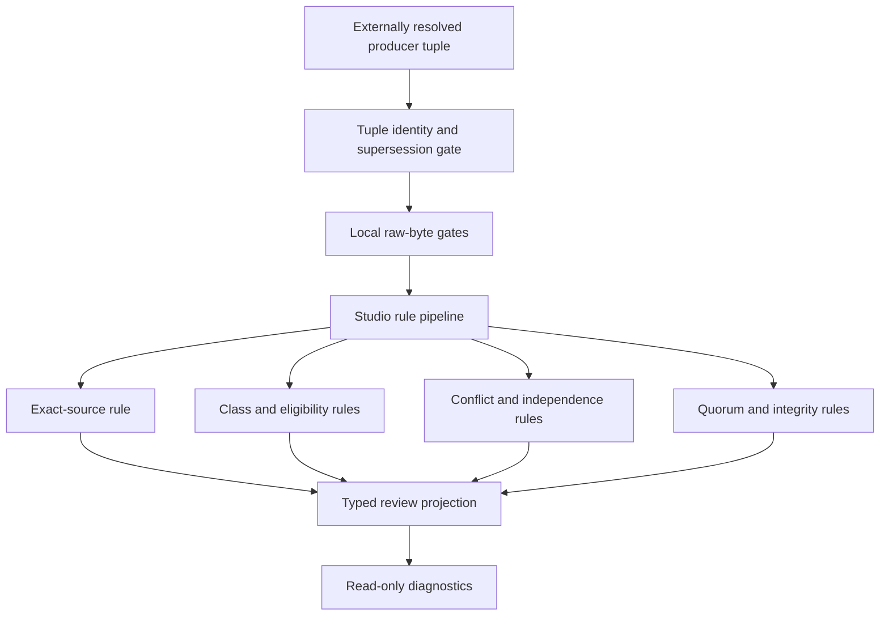

# Architecture Review Quorum Conformance

**Status:** candidate read-only consumer; synthetic evidence only  
**Resolved producer tuple:** `aevespers2/qso-field.github.io#24@49a93b25f1b04c13b97fef93a786afa4bf1048c4`  
**Upstream contract generation:** `aevespers2/qso-field.github.io@e3f0cc452d4495460c6748b7eafdd614fe6c1e78`  
**Canonical base payload SHA-256:** `a8b65c3fce4b7cf80fdefab76c497720b2bf17086d431a53f9bacf82e58bd9ec`  
**Canonical extension payload SHA-256:** `6e767141e6c76ec43366b661db0fee9090a56c9ce7d50eda28da7f1094d5e3c2`

QSO-STUDIO provides an independent, documentation-only consumer of the proposed portfolio architecture-review quorum contract. The consumer demonstrates that Studio can render and validate bounded review state without becoming a reviewer registry, appointment service, architecture authority, or activation controller.

## Source-tuple boundary

The consumer no longer treats a local fixture hash, branch name, pull-request number, or successful workflow as sufficient producer identity. Before either synthetic corpus reaches the semantic evaluator, Studio validates `fixtures/architecture-review-producer-source-v1.json` as a closed external source tuple.

The tuple binds:

- the producer repository, pull request, expected base, externally observed exact head, workflow run, artifact digest, and evidence status;
- the producer paths, Git blob identities, raw SHA-256 values, local consumer paths, local raw SHA-256 values, and canonical JSON identities;
- separate resolver and verifier identities and independence groups; and
- the explicit supersession link from the earlier `13f5f1a6...` source observation to `49a93b25...`.

The base corpus is recorded honestly as a canonical-equivalent consumer reformat rather than a byte-identical copy. The extension is byte-identical. Neither relation is accepted implicitly: each must match the frozen tuple, and the local raw-byte gate still runs before semantic parsing.

Studio fails closed before semantic validation when the tuple contains a stale or moved producer head, wrong path, missing supersession link, superseded evidence represented as current, identity or digest drift, incomplete artifact coverage, or non-independent resolution roles. A future producer-head movement does not rewrite this generation; it makes this tuple historical until a new externally resolved generation is committed and validated.

```text
branch or PR label
!= immutable producer source

successful workflow
!= externally resolved source tuple

canonical equivalence
!= byte identity

validated source tuple
!= accepted review policy or operational authority
```

## Boundary

QSO-STUDIO may:

- ingest the synthetic review fixtures only after source-tuple and raw-byte validation;
- calculate eligibility, class coverage, quorum, and independence findings;
- preserve dissent, recusal, abstention, appeal, and supersession state;
- display `REVIEW_INCOMPLETE`, `REVIEW_COMPLETE_PENDING_DECISION`, `APPEAL_REVIEW_PENDING`, or `SUPERSEDED_REVIEW`; and
- export non-authoritative diagnostic results.

QSO-STUDIO may not:

- resolve or certify its own producer source tuple as accepted governance state;
- appoint or qualify a reviewer;
- infer appointment from repository access, comments, labels, or credentials;
- count abstentions or recusals as approval;
- collapse review completion into an architecture decision;
- create activation, merge, release, publication, or deployment authority; or
- represent synthetic identities or fixtures as real governance records.

## Independent implementation

The QSO Field governance candidate uses an imperative evaluator. QSO-STUDIO uses a separate rule pipeline and independently derives the expected state and reason codes for the same canonical twelve-case base and nine-case extension payloads. Source identity is checked before semantic equivalence, and the precise producer-to-consumer copy relation is preserved rather than inferred.



**Diagram alternative:** An externally resolved producer tuple is validated first for exact repository, pull request, commit, path, evidence, independence, and supersession identity. The local corpus bytes are then checked before a separate QSO-STUDIO rule pipeline assesses source identity, class coverage, eligibility, conflicts, independence, quorum, dissent, and decision promotion. The result is a typed read-only projection; no stage can create a real appointment, decision, or activation.

## Reproduction

```bash
python3 scripts/check_architecture_review_source_tuple.py
python3 scripts/check_architecture_review_source_identity.py
python3 scripts/check_architecture_review_quorum_consumer.py
python3 -m unittest \
  tests.test_check_architecture_review_source_tuple \
  tests.test_check_architecture_review_source_identity \
  tests.test_check_architecture_review_quorum_consumer \
  -v
```

## Release interpretation

```text
resolved source tuple
+ matching local raw identities
+ matching canonical payloads
+ matching synthetic outcomes
!= accepted review policy
!= qualified or appointed reviewers
!= real quorum
!= architecture approval
!= Studio implementation authority
```

The conformance surface remains documentation and validation tooling. Product, privacy, retention, reviewer-class, qualification, appointment, conflict, appeal, emergency-review, correction, source-resolution, supersession, and rollback decisions remain blocked until repository-local architecture review records approve them.
