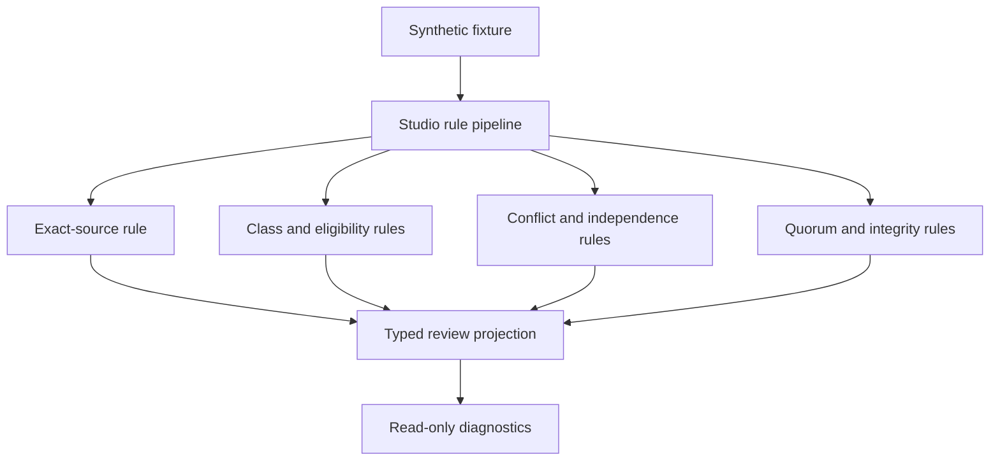

# Architecture Review Quorum Conformance

**Status:** candidate read-only consumer; synthetic evidence only  
**Upstream contract generation:** `aevespers2/qso-field.github.io@e3f0cc452d4495460c6748b7eafdd614fe6c1e78`  
**Canonical fixture payload SHA-256:** `a8b65c3fce4b7cf80fdefab76c497720b2bf17086d431a53f9bacf82e58bd9ec`

QSO-STUDIO now provides an independent, documentation-only consumer of the proposed portfolio architecture-review quorum contract. The consumer demonstrates that Studio can render and validate bounded review state without becoming a reviewer registry, appointment service, architecture authority, or activation controller.

## Boundary

QSO-STUDIO may:

- ingest the synthetic review fixture;
- calculate eligibility, class coverage, quorum, and independence findings;
- preserve dissent, recusal, abstention, appeal, and supersession state;
- display `REVIEW_INCOMPLETE`, `REVIEW_COMPLETE_PENDING_DECISION`, `APPEAL_REVIEW_PENDING`, or `SUPERSEDED_REVIEW`; and
- export non-authoritative diagnostic results.

QSO-STUDIO may not:

- appoint or qualify a reviewer;
- infer appointment from repository access, comments, labels, or credentials;
- count abstentions or recusals as approval;
- collapse review completion into an architecture decision;
- create activation, merge, release, publication, or deployment authority; or
- represent synthetic identities or fixtures as real governance records.

## Independent implementation

The QSO Field governance candidate uses an imperative evaluator. QSO-STUDIO uses a separate rule pipeline and independently derives the expected state and reason codes for the same canonical twelve-case payload. The repositories may serialize that JSON differently; both validators require the same canonical payload digest.



**Diagram alternative:** One immutable synthetic payload enters a QSO-STUDIO rule pipeline. Separate rules assess source identity, class coverage, eligibility, conflicts, independence, quorum, dissent, and decision promotion. Their findings produce a typed read-only projection and diagnostics; no rule can create a real appointment, decision, or activation.

## Reproduction

```bash
python3 scripts/check_architecture_review_quorum_consumer.py
python3 -m unittest tests.test_check_architecture_review_quorum_consumer -v
```

## Release interpretation

```text
matching canonical payload and synthetic outcomes
!= accepted review policy
!= qualified or appointed reviewers
!= real quorum
!= architecture approval
!= Studio implementation authority
```

The conformance surface remains documentation and validation tooling. Product, privacy, retention, reviewer-class, qualification, appointment, conflict, appeal, emergency-review, correction, and rollback decisions remain blocked until repository-local architecture review records approve them.
