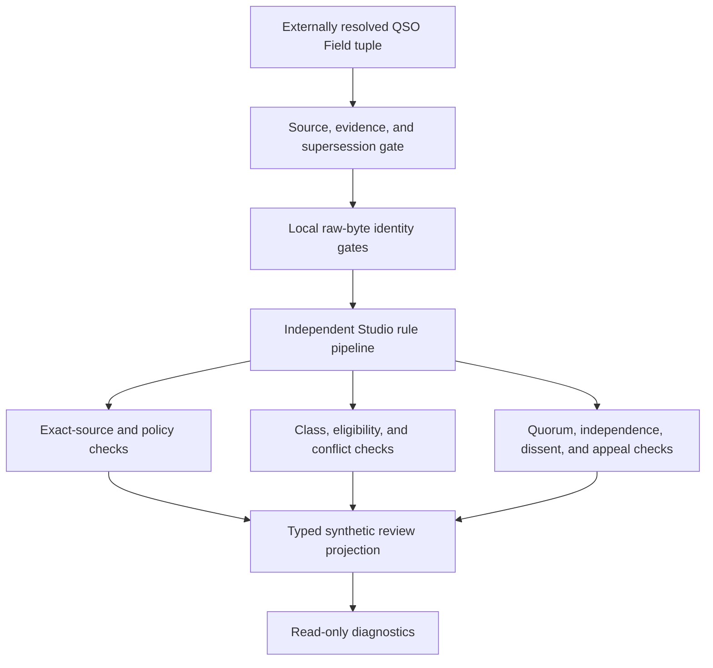

# Architecture Review Quorum Conformance

**Status:** candidate read-only consumer; synthetic evidence only  
**Resolved producer tuple:** `aevespers2/qso-field.github.io#24@a56b1fa93f151ee14f3cdd4183b89a10e268e352`  
**Producer workflow:** `Architecture Review Quorum Conformance` run `30000668553`  
**Producer artifact:** `8560824564` · `sha256:f266006a19bd8a5d95b4c7aeedfc0bac950f1932d7b58eef88ee7eac6f62e77a`  
**Evidence expiration:** `2026-08-22T10:48:09Z`

QSO-STUDIO independently consumes the proposed QSO Field architecture-review quorum corpus. It validates immutable source identity and derives synthetic review states for presentation. It does **not** appoint reviewers, establish a real quorum, decide architecture, activate implementation, or authorize merge, release, publication, deployment, or runtime activity.

## Why this repair exists

The original consumer remained on QSO-STUDIO PR #4 after `main` advanced. That branch became non-mergeable, and its producer tuple referred to historical QSO Field head `49a93b25f1b04c13b97fef93a786afa4bf1048c4`. This generation is rebuilt from current QSO-STUDIO `main`, preserves the independently authored evaluator and synthetic corpus, and rebinds the source tuple to current QSO Field PR #24 head `a56b1fa93f151ee14f3cdd4183b89a10e268e352`.

Historical evidence remains preserved in PR #4. It is not treated as current validation.

## Source and identity gates

Before semantic evaluation, Studio validates a closed external source tuple containing:

- producer repository, pull request, base, exact observed head, workflow run, artifact identity, digest, and expiration;
- producer and consumer paths, Git blob identities, raw SHA-256 values, canonical JSON identities, and copy relationships;
- independent resolver and verifier identities; and
- an explicit supersession link from the previous producer observation.

The base corpus is a canonical-equivalent reformat rather than a byte-identical copy. The extension corpus is byte-identical. Studio verifies local raw bytes before either parser runs and rejects stale heads, moved observations, wrong paths, missing supersession, expired or historical evidence represented as current, resolver/verifier collisions, duplicate JSON keys, non-finite values, unknown fields, malformed object identities, and fixture drift.

```text
branch or pull-request label
!= immutable producer identity

successful workflow
!= accepted review policy

canonical equivalence
!= byte identity

matching synthetic outcomes
!= reviewer appointment, architecture decision, or activation
```

## Consumer pipeline



**Diagram alternative:** Studio first validates the exact QSO Field source tuple, retained evidence, and supersession chain. It then verifies the local fixture bytes before an independent rule pipeline checks exact source and policy identity, reviewer classes and eligibility, conflicts, quorum, independence, dissent, appeal, emergency scope, and supersession. The result is a read-only synthetic projection; no stage creates a real appointment, decision, or operational authority.

## Synthetic dispositions

The consumer may display:

- `REVIEW_INCOMPLETE`
- `REVIEW_COMPLETE_PENDING_DECISION`
- `APPEAL_REVIEW_PENDING`
- `SUPERSEDED_REVIEW`
- `APPEAL_BLOCKED`
- `COVERAGE_EXTENSION_CLEAR`

These labels describe fixture outcomes only. `REVIEW_COMPLETE_PENDING_DECISION` explicitly remains separate from an architecture decision or activation record.

## Reproduction

```bash
python3 scripts/check_architecture_review_source_tuple.py
python3 scripts/check_architecture_review_source_identity.py
python3 scripts/check_architecture_review_quorum_consumer.py
python3 -m unittest -v \
  tests.test_check_architecture_review_source_tuple \
  tests.test_check_architecture_review_source_identity \
  tests.test_check_architecture_review_quorum_consumer
```

The exact-head workflow performs the same gates with read-only permissions, SHA-pinned Actions, disabled persisted credentials, generated evidence outside the checkout, deterministic input hashes, a clean-tree assertion, retained artifacts, and a final fail-closed disposition.

## Current blockers

The consumer remains documentation and validation tooling. Real reviewer qualification, appointment, acceptance, conflict handling, appeal authority, emergency review, architecture decision, activation, correction, retention, supersession, rollback, and ownership require separate repository-local decisions. QSO-STUDIO also remains blocked on the broader runtime-local versus Fabric-level record-role collision.

## FYSA-120 mapping

Applied capability areas: CAT-012 documentation architecture and technical editing; CAT-017 source identity, provenance, and supersession; CAT-031 conformance testing and verified builds; CAT-040 migration and rollback; CAT-052 least privilege and audit evidence; CAT-054 supply-chain verification; and CAT-059 exact-head evidence transport.

Proposed non-authoritative refinement: `031-M — cross-repository consumer rebinding after default-branch divergence`, including source-tuple renewal, preserved independent implementation, stale-candidate supersession, exact-head validation, and resulting-state verification.
