# Architecture

## Boundary model

```mermaid
flowchart LR
    S[Approved synthetic or governed source] --> I[Read-only import boundary]
    I --> N[Normalization and provenance view]
    N --> V[Accessible evidence viewer]
    V --> P[Local proposal and annotation]
    P --> E[Review packet export]
    E --> H[Separate human and repository review]
    H -. separately authorized .-> U[Upstream repository or runtime]
```

**Equivalent prose:** Studio receives only an approved synthetic or governed source through a read-only import boundary. It normalizes presentation metadata without changing the source, displays evidence accessibly, and permits local annotations. Export creates a review packet. Any repository or runtime change occurs later through a separate authorized process.

## Candidate components

| Component | Responsibility | Prohibited authority |
|---|---|---|
| Import boundary | Parse a versioned fixture and preserve exact source identity | Fetch secrets or silently accept unknown formats |
| Provenance view | Show repository, commit, artifact, contract generation, and currentness | Declare an upstream source accepted |
| Evidence viewer | Present state, confidence, conflicts, corrections, and limitations | Hide missing evidence or convert uncertainty into certainty |
| Proposal workspace | Capture annotations and candidate deltas | Apply repository or runtime changes |
| Review packet exporter | Produce a deterministic, inspectable packet | Sign, merge, publish, execute, or settle |
| Accessibility layer | Preserve keyboard, semantic, textual, and scalable alternatives | Convey required meaning through color or position alone |

## Trust boundaries

1. **Source boundary:** source bytes and provenance remain immutable inputs.
2. **Rendering boundary:** untrusted text and diagrams are treated as data, not executable content.
3. **Proposal boundary:** annotations remain distinct from accepted state.
4. **Repository boundary:** no direct write token is required for the first workflow.
5. **Runtime boundary:** Studio cannot start, stop, freeze, or alter QSO execution.
6. **Financial boundary:** payment-related records are display-only and carry no settlement authority.

## Failure states

The design fails closed when the fixture version is unknown, source identity is missing, evidence is stale or withdrawn, a correction cannot be represented, a diagram lacks equivalent prose, ownership is ambiguous, or an export cannot preserve exact inputs and limitations.

## Integration shape

Studio is a consumer of upstream contracts, not their owner. Each integration must bind an exact producer repository, immutable source generation, schema or contract identifier, canonical byte rules, correction and withdrawal semantics, accessibility representation, and rollback behavior.

This architecture is proposed documentation only and is governed by `QSO-CONSENT-CAPACITY-LOCK-v1`.
