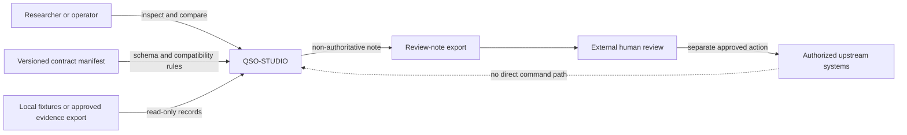
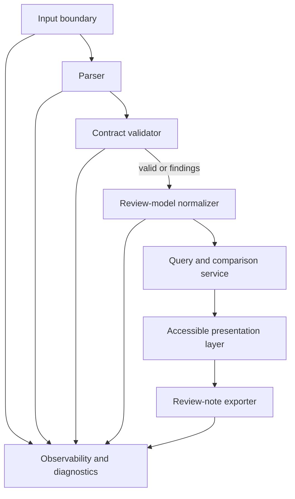
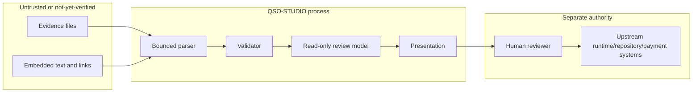

# Architecture

## Architectural objective

QSO-STUDIO should be an adapter-based review application with a deliberately narrow core. The core accepts versioned evidence bundles, validates them through explicitly selected contracts, maps them into a stable review model, and renders them without acquiring upstream authority.

## Context diagram

The dotted relationship is descriptive only: upstream systems may provide exports to Studio, but the first workflow does not create a command channel from Studio to those systems.

## Logical components

### Input boundary

Accepts only configured local fixtures or approved evidence exports. It records the input filename or source identifier, byte length, media type, digest, and import time. It does not follow embedded links or execute embedded content.

### Parser

Decodes a supported serialization format with explicit size, depth, and field-count limits. Unknown fields are preserved for diagnostics when safe, but they are not silently promoted into trusted model fields.

### Contract validator

Selects a schema by an exact identifier from the integration manifest. Validation findings are data, not exceptions hidden from the user. Unsupported versions fail closed with a clear compatibility message.

### Review-model normalizer

Maps validated domain records into a stable presentation model containing identity, source, time, integrity, status, relationships, findings, and raw evidence references. Normalization must not rewrite the source record.

### Query and comparison service

Supports deterministic filtering, sorting, relationship traversal, and field-by-field comparison over the normalized model. Queries are local and side-effect free in the first workflow.

### Accessible presentation layer

Renders summaries, detail views, timelines, tables, relationship views, validation findings, and textual alternatives for every visual representation.

### Review-note exporter

Produces a non-authoritative document containing reviewer-entered observations plus immutable references to evidence digests, schema identifiers, and Studio version. It never emits an approval token or execution instruction.

### Observability and diagnostics

Records local diagnostic events needed to reproduce parsing, validation, and rendering failures. Sensitive record content is excluded by default; diagnostic export requires deliberate user action and redaction review.

## Trust boundaries

Boundary rules:

1. Input content is untrusted until parsed and validated.
2. Rendering never interprets record text as executable markup.
3. Studio's normalized model is a view, not a new canonical record.
4. Exported notes contain references, not authority.
5. Any future write connector requires a separate ADR, threat model, contract, test plan, and release approval; it is not part of the current scope.

## Deployment candidates

The charter has not selected a platform. The architecture should remain portable across:

- a local static prototype using fixture data;
- a packaged desktop application with local-only storage;
- a browser application backed by a separately governed read-only gateway.

These are alternatives, not simultaneous commitments. The first platform decision must consider offline operation, data classification, update ownership, accessibility testing, signing, distribution, and support burden.

## Failure behavior

Studio should fail closed at the boundary it can control:

- unsupported contract: show incompatibility and do not normalize;
- digest mismatch: quarantine the bundle in memory and show the expected and actual digests;
- malformed record: preserve a bounded diagnostic excerpt and continue only with independent records;
- missing attribution: label the record incomplete and prevent authoritative-looking export;
- renderer failure: provide a plain-text record view;
- export failure: leave evidence unchanged and report the destination and error without partial authority artifacts.
