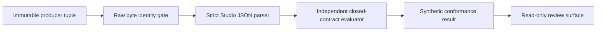

# QSO Ecosystem Conformance Consumer

**Status:** independent synthetic consumer candidate  
**Producer generation:** `aevespers2/QSO-FABRIC#21@25036a5cfcea79e204a4660ddd1af09c054935b1`  
**Authority effect:** none

QSO-STUDIO independently checks the closed ecosystem manifest contract proposed by QSO-FABRIC. It does not import the producer validator and does not treat a matching fixture, passing test, workflow artifact, or review packet as ecosystem admission, reviewer appointment, execution authority, release approval, or deployment permission.

This page restores the useful conformance work from superseded QSO-STUDIO PR #4 onto current `main` after the documentation baseline merged. The former candidate remains historical because it diverged from current `main` and bound an older producer head.

## Boundary

The consumer validates the frozen producer source tuple and exact manifest bytes before parsing. Only then does a separate implementation check:

- closed top-level and nested field sets;
- strict UTF-8 and JSON with duplicate-key and non-finite-number rejection;
- exact integer-versus-Boolean typing;
- semantic versions, identifiers, bounds, and safe relative paths;
- unique capability, constraint, interface, and alias identities;
- default-deny external-network and consequential-action capabilities;
- interface role, idempotency, and retry fields; and
- governance identity, human override, and audit logging.



**Diagram alternative:** An immutable QSO-FABRIC source tuple binds the exact producer head, path, Git blob, and SHA-256. QSO-STUDIO checks its local fixture bytes, parses them with an independent strict parser, applies a separately implemented closed-contract evaluator, and produces a read-only synthetic result. No stage grants operational authority.

## Reproduction

```bash
python3 scripts/check_ecosystem_conformance_consumer.py
python3 -m unittest tests.test_check_ecosystem_conformance_consumer -v
```

## Interpretation

```text
byte-identical fixture
+ independent parser and evaluator
+ matching accepted/rejected reason classes
+ exact-head retained evidence
!= accepted ecosystem standard
!= component admission
!= execution, release, publication, or deployment authority
```

## Material semantic obstruction

The manifest-level consumer proves only that Studio can independently reproduce the declared manifest rules. It does not resolve the portfolio-wide role collision in which `qso-event-ledger` and `qso-runtime-report` are used for both runtime-local and Fabric-level records. Accepted namespace partitioning, payload schemas, producer identities, transformation receipts, correction and revocation propagation, mixed-generation rebinding, overlap witnesses, and rollback remain required before live composition can be claimed.

## Skill-tree mapping

- CAT-012: precise technical documentation and reproducible operator guidance.
- CAT-017: exact source, correction, and supersession provenance.
- CAT-031: independently implemented invariants and regression testing.
- CAT-044: hostile parser and semantic mutation coverage.
- CAT-052: SHA-256 and Git-blob source identity.
- CAT-054: consumer-side supply-chain verification.
- CAT-059: exact-head evidence and attestation transport.

Proposed non-authoritative gap: `031-M — cross-repository consumer rebinding after default-branch divergence`, covering immutable fixture preservation, source-head refresh, independent implementation continuity, stale-candidate supersession, and resulting-head verification.

## Remaining blockers

Human architecture review must still decide the conformance levels, governance semantics, neutral contract custody, source refresh and supersession process, signed evidence and trusted time, migration and rollback rules, cross-repository interface fixtures, security, licensing, accessibility, and resulting-default-branch validation.
