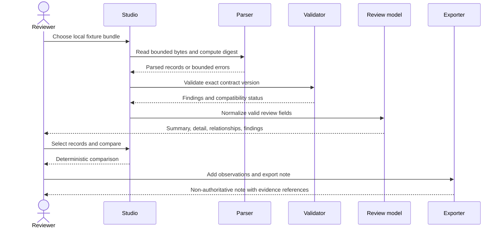

# Read-only evidence-review workflow

## Goal

Demonstrate that QSO-STUDIO can help a reviewer understand a bounded evidence bundle without mutating evidence or obtaining authority that belongs to another system.

## Preconditions

- A product/UX charter is approved.
- One record type and exact contract version are approved by their owning repository.
- A deterministic fixture set contains representative valid, invalid, incomplete, and incompatible records.
- The integration manifest identifies owner, schema digest, media type, classification, and retention.
- The build contains no upstream write, execution, signing, or payment client.

## Primary flow

## Detailed steps

### 1. Select evidence

The reviewer chooses a local fixture bundle through the platform file picker. Studio shows the path or source label, media type, size, and computed digest before parsing. It does not recursively import neighboring files.

### 2. Parse within limits

Studio applies configured limits for bytes, nesting depth, record count, string length, and total decoded fields. A limit failure produces a stable error code and does not attempt partial interpretation of the affected record.

### 3. Verify compatibility

The bundle declares a record type and contract identifier. Studio matches those values against the integration manifest. An unknown identifier is displayed as incompatible; the user may inspect bounded raw text but cannot treat it as normalized evidence.

### 4. Validate integrity and structure

Studio compares declared and computed digests when supplied, then validates each record against the exact contract. Findings identify record and field paths. Independent records may still be reviewed when one record fails, provided the bundle contract explicitly permits independent processing.

### 5. Present the review model

The summary view shows:

- record identity and type;
- source owner and source identifier;
- observed/effective time and sequence where applicable;
- integrity status;
- contract compatibility;
- domain status;
- highest-severity findings;
- relationship count and evidence reference.

### 6. Compare records

The reviewer selects two compatible records. Studio presents added, removed, and changed fields in deterministic path order, preserving type information and source values. Derived summaries are labeled as Studio interpretations.

### 7. Record observations

Reviewer notes are stored only in the current session for the first workflow. They are visually and structurally separate from source evidence.

### 8. Export a note

The exported note includes evidence and build references plus the reviewer's observations. It states that it is not an approval, command, settlement, source record, or replacement for the owning system.

## Alternate and failure flows

| Condition | Required behavior |
|---|---|
| Unsupported media type | Reject before parsing and list supported types |
| Size or complexity limit exceeded | Reject with the exact limit and observed value |
| Unknown contract | Mark incompatible; do not normalize |
| Digest mismatch | Show both digests and prevent authoritative-looking export |
| Missing attribution | Mark incomplete and include finding in any export |
| Mixed contract versions | Partition only when the manifest explicitly permits it |
| Malformed record | Isolate the record; preserve bounded diagnostics |
| Visualization failure | Fall back to accessible table or plain text |
| Export destination unavailable | Preserve session state and report no export was created |

## Deterministic fixture matrix

The first approved fixture set should include at least:

1. one minimal valid record;
2. one complete valid record with relationships;
3. one record with a structural validation error;
4. one record with a digest mismatch;
5. one unsupported contract version;
6. one unknown field that is safe to preserve;
7. one missing-attribution record;
8. one large-but-allowed bundle;
9. one bundle exceeding each configured resource limit;
10. one comparison pair with additions, removals, type changes, and reordered input fields.

Each fixture needs an expected result file and content digest so UI tests can verify both semantics and presentation states.

## Acceptance criteria

The workflow is acceptable only when:

- fixture results are deterministic across supported platforms;
- no source file is modified;
- the process performs no network request by default;
- unsupported records never appear as fully compatible;
- all views and errors are keyboard accessible;
- textual alternatives expose the same material information as diagrams;
- exported notes cite exact evidence and build digests;
- security, accessibility, recovery, and rollback tests pass;
- a human reviewer approves the evidence package.
